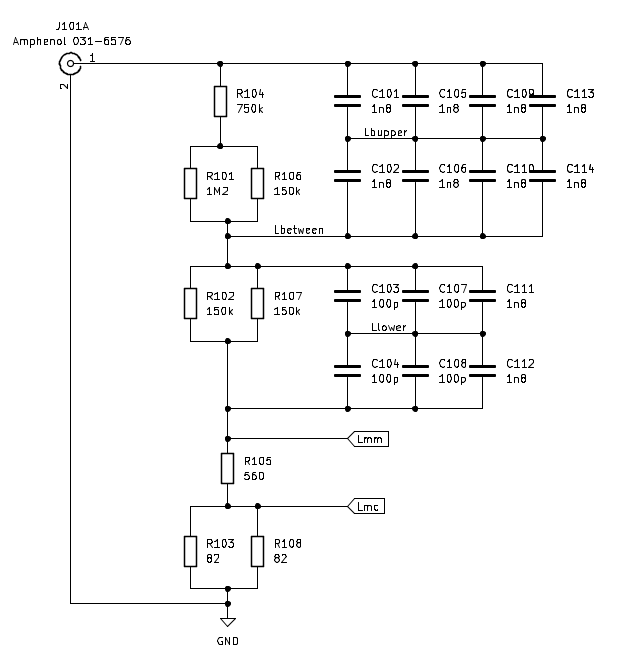
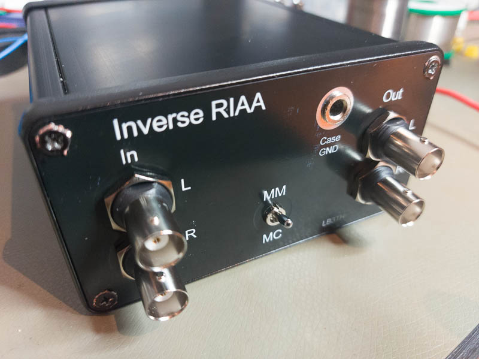
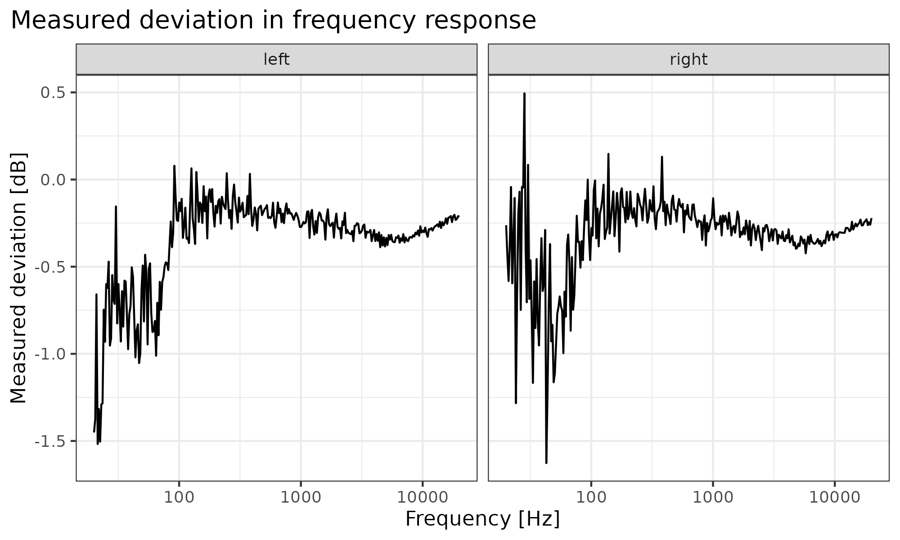

#  Inverse RIAA filter

Inverse RIAA filter for testing phono preamps. If we want to test phono preamps with
a soundcard interface, we need a lot of attenuation of the soundcard output - and we
would also like to invert the RIAA filtering that is part of an ordinary phono 
preamp such that the soundcard input receives a signal which, under ideal operation,
has a constant amplitude as the frequency varies.

## The schematic

The design is a simple and direct implementation of the suggestion of Lipshitz and Jung (1980),
in their paper "A High Accuracy Inverse RIAA Network" (Figure 3). I have adapted it by paralleling
some parts for greater accuracy.

## First physical build

This is a passive filter. I have built one into a Hammond 1455N1201BK extruded box,
with isolated (stereo) BNCs in and out. There is an option to add 20 dB of attenuation
for testing MC phono preamps.

First build with the front panel from jlcpcb had some issues:

1. The switch and the BNC connectors should have been more forward on the board, accounting for the plastic bezel. As it is now, the nuts on the BNC connectors (the only thing holding the filter board to the front panel) can't be tightened too much, or the front panel will bend.
2. The mounting holes were off by a bit and quite tight. I drilled them out to make the front panel sit flat, not pretty.
3. The grounding of the case needs a bit more work; since the box is anodized there is not good contact throughout.

For this first build I have used Susumu 0.5% resistors and Murata 1% capacitors.

## Characterization

Measurement of the attenuation and comparison to what we should expect (calculated
in LT spice) indicates that the filter is within 0.2 dB of the correct curve over
most of the frequency range.

Note that the measurements (in the MM path) were taken with an Analog Discovery
2, whichonly has a 14 bit ADC, so there is a lot of noise and quantization
error at the lower frequencies.